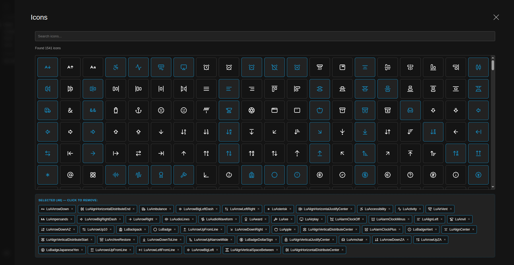

# payload-icon-picker

A field plugin for Payload CMS 3.x that adds a highly optimized icon picker. It supports both a searchable dropdown interface and an advanced grid-based sliding drawer panel. It automatically extracts and saves the selected icon name and its raw SVG string to the database, allowing you to render icons on your frontend without importing or bundling heavy icon packages.

## Features

- **Multiple Presentation Modes**:
  - `select` (Default): A sleek, searchable, and virtualized dropdown list.
  - `drawer`: An advanced layout that opens a sliding side panel containing a performance-focused, virtualized grid of icons.
- **Smart UX Carousel in Drawer**: Selected icons are safely duplicated inside a dedicated sticky basket bar at the top of the grid. Users can click to remove them instantly without losing their scroll positions in the alphabetized grid.
- **SVG Extraction**: The raw SVG is extracted and saved directly to the database as JSON, meaning zero icon package dependencies are required on your client-facing frontend.
- **Virtualized Grid & Lists**: Powered by `@tanstack/react-virtual` to seamlessly handle icon packs with over 10,000+ items without a single drop in frame rate or input latency.
- **Custom & Collection-Specific Icon Packs**: Supports any icon pack (such as `react-icons` or custom SVG sets) globally or mapped to specific collections.
- **Fuzzy Searching**: Powered by `fuse.js` to provide lightning-fast, typo-tolerant search across all icon names in both drawer and dropdown modes.
- **Multi-select Support**: Full support for choosing multiple icons when `hasMany: true` is configured.

## Installation

Install the package in your Payload project:

```bash
# pnpm
pnpm add payload-icon-picker

# npm
npm install payload-icon-picker

# yarn
yarn add payload-icon-picker

# Bun
bun add payload-icon-picker
```

## Usage

### 1. Register the Plugin in `payload.config.ts`

The plugin can automatically add fields to collections and/or register a global icon provider.

```typescript
import { buildConfig } from 'payload'
import { payloadIconPicker } from 'payload-icon-picker'

export default buildConfig({
  plugins: [
    payloadIconPicker({
      // 1. (Optional) Auto-add fields to collections
      collections: {
        categories: true,
        posts: {
          name: 'postIcon',
          label: 'Post Icon',
        },
      },
      // 2. (Optional) Register a global provider for icons
      iconPackProviderPath: './components/IconPackProvider#IconPackProvider',
    }),
  ],
})
```

### 2. Create a Client Provider (Optional)

If you want to use a global set of icons, create a client-side provider. If you don't provide this, you'll need to pass icons directly to the field (see "Standalone Use" below).

Create a file (e.g., `components/IconPackProvider.tsx`):

```tsx
'use client'

import React from 'react'
import { IconPackProvider as BaseProvider } from 'payload-icon-picker/client'
import { icons as LucideIcons } from 'lucide-react'
import * as FontAwesomeIcons from 'react-icons/fa'

export const IconPackProvider: React.FC<{ children: React.ReactNode }> = ({ children }) => {
  return (
    <BaseProvider
      icons={LucideIcons} // Global fallback
      collections={{
        posts: FontAwesomeIcons, // Collection-specific
      }}
    >
      {children}
    </BaseProvider>
  )
}
```

> [!NOTE]
>
> ### 💡 Integration Tip for `lucide-react` Users
>
> If you want to use the **`lucide-react`** package as your icon provider, avoid using wildcard imports (`import * as Lucide`). Wildcard imports pull in internal component factories and configuration utilities that can cause runtime scrolling errors in Next.js 16 / Turbopack environments.
>
> Instead, import the clean `icons` object directly:
>
> ```typescript
> import { icons as LucideIcons } from 'lucide-react'
>
> // Pass `LucideIcons` into your IconPackProvider
> ```
>
> This guarantees a 100% stable, fast, and seamless virtualized scrolling experience in the Payload admin panel.

## Advanced Usage

### Using in Blocks or Globals

You can inject the icon picker manually anywhere inside your fields schema (Collections, Blocks, Globals) using the exported iconField helper. You can now define whether it should display as a standard dropdown list or a sliding drawer layout using the displayMode flag.

```typescript
import { iconField } from 'payload-icon-picker'

export const MyBlock = {
  slug: 'iconBlock',
  fields: [
    // Standard Searchable Dropdown mode (Default)
    iconField({
      name: 'icon',
      label: 'Block Icon',
      hasMany: false,
    }),

    // Sliding Drawer mode
    iconField({
      name: 'drawerIcon',
      label: 'Drawer Icon',
      hasMany: true,
      displayMode: 'drawer',
    }),
  ],
}
```

### Standalone (Isolated) Use

If you want to use a specific icon pack for a single field without registering a global provider, create a simple client-side wrapper:

**1. Create the wrapper (`components/CustomIconPicker.tsx`):**

```tsx
'use client'
import React from 'react'
import { IconPicker } from 'payload-icon-picker/client'
import { icons as MyIcons } from 'lucide-react'

export const CustomIconPicker = (props) => <IconPicker {...props} icons={MyIcons} />
```

**2. Use it in your field config:**

```typescript
import { iconField } from 'payload-icon-picker'

const myField = iconField({
  admin: {
    components: {
      Field: './components/CustomIconPicker#CustomIconPicker',
    },
  },
})
```

## Rendering Icons on the Frontend

The plugin exports an `IconRenderer` helper component that converts a saved SVG string back into a proper React element. It parses the raw SVG, forwards your props (`className`, `color`, `size`, etc.) onto the root `<svg>` element, and requires **zero icon-library dependencies** on your frontend.

```tsx
import { IconRenderer } from 'payload-icon-picker/client'

// Assuming `icon` was fetched from Payload (see Database Schema below)
;<IconRenderer svgString={icon.svg} size={32} color="currentColor" className="my-icon" />
```

### Props

| Prop            | Type                            | Required | Description                                            |
| :-------------- | :------------------------------ | :------- | :----------------------------------------------------- |
| **`svgString`** | `string`                        | ✅       | The raw SVG string saved by the icon picker field.     |
| **`size`**      | `number \| string`              | —        | Sets both `width` and `height` on the `<svg>` element. |
| **`color`**     | `string`                        | —        | Overrides `fill` and `stroke` colors where applicable. |
| **`className`** | `string`                        | —        | Appended to the SVG's existing class names.            |
| **`...rest`**   | `React.SVGProps<SVGSVGElement>` | —        | Any additional SVG attributes are forwarded through.   |

## Database Schema

When saved, the field outputs a structured object (or an array of objects if `hasMany: true`), preserving both semantic names and optimized SVG paths directly into your records:

```json
// Single Select Mode (hasMany: false)
"icon": {
  "name": "LuAperture",
  "svg": "<svg stroke=\"currentColor\" fill=\"none\" stroke-width=\"2\" viewBox=\"0 0 24 24\" ... >...</svg>"
}

// Multi Select Mode (hasMany: true)
"icons": [
  {
    "name": "LuAperture",
    "svg": "<svg ... >...</svg>"
  },
  {
    "name": "LuArrowDown",
    "svg": "<svg ... >...</svg>"
  }
]
```

## Configuration Reference

### Plugin Options (`PayloadIconPickerConfig`)

| Option                     | Type                                 | Default     | Description                                                 |
| :------------------------- | :----------------------------------- | :---------- | :---------------------------------------------------------- |
| **`collections`**          | `Record<string, boolean \| Options>` | `undefined` | Dictionary of collection slugs to append the icon field to. |
| **`iconPackProviderPath`** | `string`                             | `undefined` | Path to the global client provider.                         |
| **`name`**                 | `string`                             | `'icon'`    | Global fallback field name.                                 |
| **`hasMany`**              | `boolean`                            | `false`     | Global fallback for multi-select.                           |
| **`label`**                | `string`                             | `'Icon'`    | Global fallback label.                                      |
| **`displayMode`**          | `'drawer'` \| `'select'`             | `'select'`  | Global fallback display mode.                               |
| **`disabled`**             | `boolean`                            | `false`     | If true, disables the plugin.                               |
| **`drawerItemsPerRow`**    | `number`                             | `20`        | Global fallback for number of icons per row in drawer mode. |
| **`drawerIconSize`**       | `number`                             | `24`        | Global fallback for icon display size inside the drawer.    |
| **`drawerRowHeight`**      | `number`                             | `80`        | Global fallback for virtualized row container height.       |

### Field Options (`iconField`)

| Option                  | Type                     | Default     | Description                             |
| :---------------------- | :----------------------- | :---------- | :-------------------------------------- |
| **`name`**              | `string`                 | `'icon'`    | Field name.                             |
| **`label`**             | `string`                 | `'Icon'`    | Field label.                            |
| **`hasMany`**           | `boolean`                | `false`     | Enable multi-select.                    |
| **`description`**       | `string`                 | `undefined` | Helper text.                            |
| **`displayMode`**       | `'drawer'` \| `'select'` | `'select'`  | Display mode.                           |
| **`drawerItemsPerRow`** | `number`                 | `20`        | Number of icons per row in drawer mode. |
| **`drawerIconSize`**    | `number`                 | `24`        | Icon rendering size inside the drawer.  |
| **`drawerRowHeight`**   | `number`                 | `80`        | Virtualized row container height.       |
| **`admin`**             | `FieldAdmin`             | `undefined` | Standard Payload admin field config.    |
